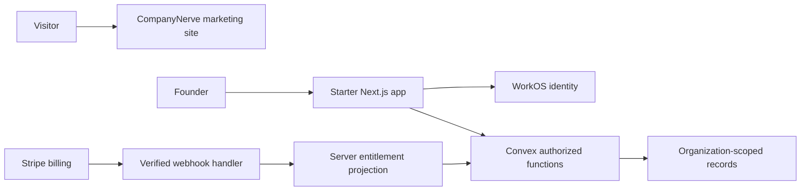

# Architecture

The template serves two related purposes: the CompanyNerve website explains the free template, and the starter demonstrates how a founder builds their own SaaS. Keep their product content and deployments separate.

## Structure after approval

The implementation uses these boundaries:

```text
apps/
  marketing/           CompanyNerve website at companynerve.com
  starter/             Example SaaS and authenticated application
convex/                Starter backend and authorization
packages/
  company-config/      Validated roles, plans, resources, and journeys
  design-recipes/      Five token sets and layout recipes
docs/                  Founder setup, architecture, operations, and evidence
.agents/skills/        Versioned coding guidance
```

Start with pnpm workspaces. Add a build orchestrator only if measured build duplication warrants it. Keep starter-specific UI in the starter until sharing is real. Marketing should build without WorkOS, Convex, or Stripe secrets.

## Request and trust flow



This diagram is the proposed direct-Stripe projection path. The phase-one integration spike can replace it with WorkOS entitlement synchronization if revocation and refresh semantics meet the acceptance criteria. Record that choice once, then implement one authority.

## Proposed stack

| Concern      | Initial choice                                        | Why                                                        |
| ------------ | ----------------------------------------------------- | ---------------------------------------------------------- |
| Runtime      | Node 24                                               | Matches the existing local toolchain and Vydero's baseline |
| Dependencies | pnpm workspaces, one exact version and lockfile       | Reproducible installs without a large build platform       |
| Web          | Next.js App Router, React, strict TypeScript          | Existing experience and provider integration support       |
| UI           | Tailwind and selected shadcn primitives               | Own component source and customize actual layouts          |
| Data         | Convex                                                | Transactions, reactive data, and server-side authorization |
| Identity     | WorkOS AuthKit                                        | Identity and organization integration                      |
| Billing      | Stripe in test mode first                             | Checkout, subscription management, and event integration   |
| Validation   | Zod at external/config boundaries                     | Detect malformed inputs before business logic              |
| Verification | Vitest, convex-test, Playwright, accessibility checks | Deterministic boundary tests and critical browser journeys |
| Hosting      | Separate Vercel marketing and starter projects        | Avoid coupling website availability to the demo backend    |

Verify compatible package versions and provider instructions in phase one. Do not freeze the report's versions in this planning repository. Add telemetry, mail, and object storage only when a shipped feature needs them. Prefer Convex storage for the first small example attachment if one is required; large artifact storage is deferred.

## Template distribution and updates

The implementation needs an export or documented copy path that includes the starter, backend, chosen recipe, required packages, docs, and relevant skills. It must omit CompanyNerve-only marketing, project IDs, secrets, and deployment metadata. Verify the exported result in a fresh directory before a release.

Use tagged template releases and explicit migration notes. Founders own their copies. Do not overwrite customized products during updates. A template-version marker and changed-file guide are enough initially; a merge/update CLI is deferred.

See [domain contracts](contracts.md), [architecture decisions](adr/0001-template-boundaries.md), and [acceptance criteria](acceptance.md).

## Implemented authority decisions

ADR 0002 supersedes the earlier membership proposal. WorkOS owns identity; Convex owns application organizations, invitations, and roles. Current membership is checked in every database operation. Stripe is the billing authority, with a single Convex entitlement projection. No WorkOS organization synchronization or generalized extension runtime is implemented.

The shared `packages/ui` contains small Radix/CVA-based, shadcn-compatible primitives. Native selects preserve keyboard behavior. Both apps consume shared recipe CSS. CompanyNerve uses system fonts while the final design remains open.
